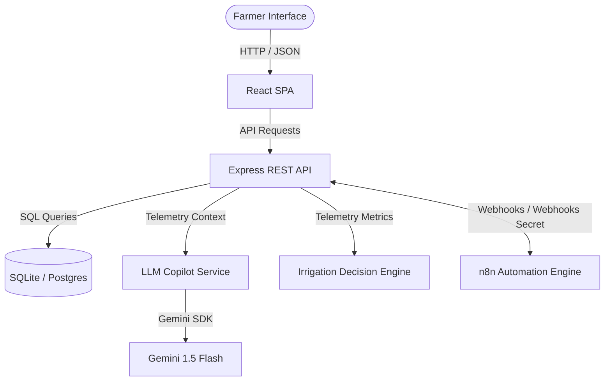

# System Architecture - AgriMind AI

This document details the architectural layout, communication loops, and code modules of AgriMind AI.

## Architectural Layers

AgriMind AI is structured as a decoupled full-stack platform:

### 1. Presentation Layer (Frontend)
- **Framework**: React.js with TypeScript and Vite.
- **State Management**: React Context (`FarmContext`) which acts as the frontend event loop dispatcher. It manages authentication, farm/field switching, telemetry loads, chat states, and demo simulation runs.
- **Styling**: Tailwind CSS with custom glassmorphism components (`glass-panel`) for a dark-mode agricultural design.
- **Charts**: Recharts coordinates area and bar charts for water analytics and soil curves.

### 2. Application Layer (Backend)
- **Server**: Express.js with TypeScript NodeNext module resolution.
- **Services**:
  - `IrrigationDecisionService`: Houses configurable agronomic rule thresholds (moisture minima, weather overriding).
  - `LLMCopilotService`: Generates system prompts loaded with live farm variables for localized Gemini or fallback responses.
  - `DemoService`: Orchestrates DB transactions mimicking rain forecasts, crop pathogens, and soil chemical shifts.

### 3. Data Layer (Database)
- **Local Fallback**: SQLite3 embedded instance. Runs local migrations automatically on startup and seeds standard demo farmer values.
- **Production Schema**: Relational design fully compatible with PostgreSQL. Relational foreign key links secure user profiles, farm records, and feedback loops.
